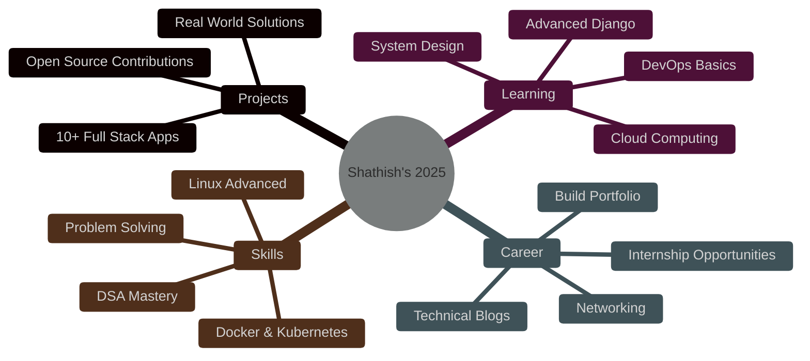

<div align="center">
  
<!-- Animated Header with Vibrant Gradient -->


<!-- Dynamic Typing Animation with Multiple Colors -->


<br/>

<!-- Vibrant Social Badges -->
[](https://www.linkedin.com/in/shathish-m)
[](https://github.com/shathish-m)
[](mailto:shathishmails@gmail.com)
[](https://github.com/shathish-m)
<br/>


</div>

<br/>

---

<div align="center">

## 🎯 **About Me**

</div>

```javascript
const shathish = {
    education: "🎓 B.Tech in CSE (AI & ML) @ SRM Institute",
    location: "📍 Chennai, Tamil Nadu, India",
    status: "💼 Final Year Student | 🔍 Seeking Opportunities",
    currentFocus: ["Full-Stack Development", "Django", "Python", "SQL"],
    askMeAbout: ["Linux Automation", "Web Development", "Shell Scripting", "UI/UX"],
    technologies: {
        frontend: ["HTML5", "CSS3", "JavaScript", "Bootstrap"],
        backend: ["Python", "Django", "SQLite", "C++"],
        tools: ["Git", "GitHub", "VS Code", "Docker", "Figma", "Excel"],
        platforms: ["Firebase", "WordPress", "Linux"],
    },
    currentlyLearning: "📚 System Design & Advanced Django",
    2025Goals: "Build 10 impactful projects & contribute to Open Source",
    funFact: "🚀 I automated 90% of WiFi configuration tasks using Bash!"
};
```

<br/>

---

<div align="center">

## 💻 **Tech Stack & Skills**

</div>

<div align="center">

### 🎨 **Frontend Development**


### ⚙️ **Backend Development**


### 🛠️ **Tools & Technologies**


### 🖥️ **Operating Systems**


</div>

<br/>

---

<div align="center">

## 🚀 **Featured Projects**

</div>

<table align="center" width="100%">
<tr>
<td width="50%" valign="top">

<div align="center">

### 📚 **Smart Learning Management System**


**🎯 Impact:**
- 🔐 Secure user authentication system
- 📈 **50%** ↑ course access efficiency
- 👥 **35%** ↑ user engagement
- 🎨 Responsive & modern UI design

**💻 Tech Stack:**
<br/>


</div>

</td>
<td width="50%" valign="top">

<div align="center">

### 🔐 **Secure Authentication Page**


**🎯 Impact:**
- ✅ Real-time form validation
- 🚀 **40%** ↑ authentication success
- ⚡ **25%** ↓ login time
- 🛡️ Enhanced security & UX

**💻 Tech Stack:**
<br/>


</div>

</td>
</tr>

<tr>
<td width="50%" valign="top">

<div align="center">

### 📡 **WiFi Automation Script**


**🎯 Impact:**
- ⚡ **90%** automation of WiFi tasks
- 🔧 **75%** ↓ manual setup effort
- 🎯 **60%** ↓ connection errors
- 🐧 Advanced Linux expertise

**💻 Tech Stack:**
<br/>


</div>

</td>
<td width="50%" valign="top">

<div align="center">

### 🌟 **More Projects Coming Soon!**


**🎯 What's Next:**
- 🔨 Building innovative solutions
- 💡 Exploring new technologies
- 🤝 Open to collaborations
- 🚀 Stay tuned for updates!

**💻 Interests:**
<br/>


</div>

</td>
</tr>
</table>

<br/>

---

<div align="center">

## 📊 **GitHub Analytics**

</div>

<div align="center">


</div>

<br/>

---

<div align="center">

## 🏆 **Achievements & Certifications**

</div>

<div align="center">

| 🎖️ **Achievement** | 📅 **Year** | 🏢 **Organization** | 🔗 **Link** |
|:---|:---:|:---:|:---:|
| 🏅 **72-Hour Hackathon - Digithon 1.0** | 2024 | SRM Institute | [View](https://github.com/shathish-m) |
| 📝 **Quiz Program on NEP Saarthi** | 2025 | SRM Institute | [View](https://github.com/shathish-m) |
| 📊 **Data Analysis using Microsoft Excel** | 2025 | Coursera | [View](https://github.com/shathish-m) |
| 🌱 **Volunteer, Green Voice Global NGO** | 2024 | Green Voice Global | [View](https://github.com/shathish-m) |

</div>

<br/>

---

<div align="center">

## 🎯 **Current Goals for 2025**

</div>

<div align="center">



</div>

<br/>

---

<div align="center">

## 💭 **Developer Wisdom**


</div>

<br/>

---

<div align="center">

## 🤝 **Let's Connect & Collaborate!**


<br/>

### 💼 **Open to exciting opportunities and collaborations!**

<br/>

[](https://www.linkedin.com/in/shathish-m)
[](mailto:shathishmails@gmail.com)
[](https://github.com/shathish-m)

<br/>

### ⭐ **If you find my work interesting, don't forget to star my repositories!**

<br/>


</div>
